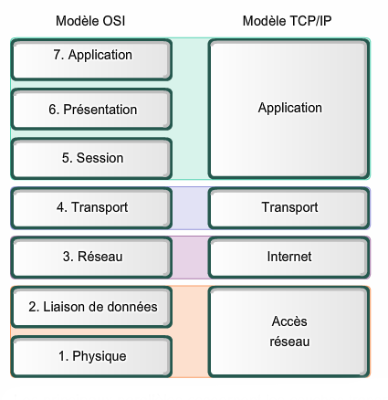

# TCP/IP

## Introduction

`TCP/IP` signifie `Transmission Control Protocol / Internet Protocol` et constitue une suite de protocole de communication utilisés pour interconnecter des périphériques de réseau sur internet. Il est également utilisé comme protocole de communication dans un réseau privé.

L'ensemble de la suite `IP` (qui est un ensemble de règles et de procédures) est communément appelé `TCP/IP`. `TCP` et `IP` sont les deux principaux protocoles, bien que d'autres soient inclus dans la suite. La suite de protocole `TCP/IP` fonctionne comme une couche d'abstraction entre les applications internet et la structure de routage et de commutation.

Le protocole `TCP/IP` spécifie la manière dont les données sont échangées sur internet en fournissant des communications bout en bout qui identifient la manière dont les données doivent être divisée en paquets, adressées, transmises, acheminées et reçue à la destination. Le protocole `TCP/IP` nécessite peu de gestion centrale et est conçu pour rendre les réseaux fiables en leur donnant la capacité de se rétablir automatiquement en cas de défaillance de n'importe quel appareil du réseau.

Les deux principaux protocoles de la suite IP remplissent des fonctions spécifiques. Le protocole `TCP` définit la manière dont les applications peuvent créer des canaux de communications à travers un réseau. Il gère également la façon dont un message est assemblé en petits paquets avant d'être transmis sur internet et réassemblé dans le bon ordre à l'adresse de destination.

Le protocole `IP` définit la manière d'adresser et d'acheminer chaque paquet pour s'assurer qu'il atteint la bonne destination. Chaque ordinateur passerelle du réseau vérifie cette adresse IP pour déterminer ou transmettre le message.

Un masque de sous-réseau indique à un ordinateur, ou à un autre périphérique de réseau, quelle partie de l'adresse `IP` est utilisée pour représenter le réseau et quelle partie est utilisée pour représenter les hôtes, ou les autres ordinateurs, sur le réseau.

Le `NAT` ou `Network address translation` est la virtualisation des adresses `IP`. Le `NAT` permet d'améliorer la sécurité et de réduire le nombre d'adresses `IP` dont une organisation a besoin.

Voici une liste de protocoles `TCP/IP` courant :

- `HTTP` qui est le protocole qui gère la communication entre un serveur web est un navigateur.
- `HTTPS` qui gère la connexion sécurisée entre un serveur web est un navigateur.
- `FTP` qui gère la transmission de fichier sur le réseau.

## Comment fonctionne TCP/IP ?

Le protocole `TCP/IP` utilise le modèle de communication client-serveur dans lequel un utilisateur ou une machine (client) reçoit un service, comme l'envoi d'une page web, d'un autre ordinateur (serveur) sur le réseau.

Cellectivement, la suite de protocoles `TCP/IP` est classée comme étant sans état, ce qui signifie que chaque demande d'un client est considérée comme nouvelle parce qu'elle n'est pas liée auc demandes précédentes. Le fait d'être sans état libère les chemins du réseau afin qu'ils puissent être utilisés en permanence.

Toutefois, la couche transport est avec état. Elle transmet un message unique et sa connexion reste en place jusqu'a ce que tous les paquets d'un message aient été reçus et réassemblés à la destination.

Le modèle `TCP/IP` diffère légèrement du modèle de réseau à sept couches `OSI` (`Open Systems Interconnection`), par il s'en inspire largement. Le modèle `OSI` définit la manière dont les applications peuvent communiquer sur le réseau.

## Pourquoi TCP/IP est important

`TCP/IP` n'est pas propriétaire et, par conséquent, n'est pas contrôlé par une seule entreprise. La suite `IP` peut donc être modifiée facilement. Elle est compatible avec tous les systèmes d'exploitation et peut donc communiquer avec n'importe quel autre système. La suite `IP` est également compatible avec tous les types de matériel informatique et de réseaux.

`TCP/IP` est hautement évolutif et, en tant que protocole routable, peut déterminer le chemin le plus efficace à travers le réseau. Il est largement utilisé dans l'architecture actuelle d'internet.

## Les quatres couches du modèle TCP/IP

Le protocole `TCP/IP` est divisé en quatres couches, chaqune d'entre elles comprenant des protocoles spécifiques :

- La couche **4** `Application` fournit aux applications un échange de données normalisé. Ses protocoles comprennent `HTTP(S)`, `FTP`, `POP3`, `SMTP` et `SNMP`. Sur cette couche, la charge utile et constituée des données de l'application proprement dite.
- La couche **3** `Transport` est responsable du maintien des communications de bout en bout sur le réseau. Le protocole `TCP` gère les communication entre les hôtes et assure le contrôle du flux, le multiplexage et la fiabilité. Les protocoles de transport comprennent `TCP` et `UDP` (`User Datagram Protocol`), qui est parfois utilisé à la place de `TCP`.
- La couche **2** `Réseau` ou la couche `Internet` traite les paquets et connecte des réseaux indépendants pour transporter les paquets à travers les frontières du réseau. Les protocoles de la couche réseau sont `IP` et `ICMP` (`Internet Control Message Protocol`), qui est utilisé pour signaler les erreurs.
- La couche **1** `Physique` ou couche de `Liaison de données`, se compose de protocole qui ne fonctionne que sur une liaison (le composant du réseau qui interconnecte les noeuds ou les hôtes dans le réseaux locaux et le réseau). Les protocoles de cette couche la plus basse comprennent Ethernet pour les réseaux locaux et `ARP` (`Address Resolution Protocol`).

## Utilisation de TCP/IP

`TCP/IP` peut être utilisé pour fournir une connexion à distance sur le réseau pour le transfert de fichiers, pour envoyer des mails, pour envoyer des pages web sur le réseau et pour accéder à distance au système de fichiers d'un serveur. Plus généralement, il est utilisé pour représenter la manière dont l'information change de forme lorsqu'elle voyage sur le réseau, depuis la couche physique concrète jusqu'à la couche d'application abstraite. Il détaille les protocoles de base, ou méthode de communication, à chaque couche au fur et à mesure que l'information passe.

## Avantages et inconvénients de TCP/IP

Les avantages de l'utilisation de `TCP/IP` sont le suivants :

- Permet d'établir une connexion entre différents types d'ordinateurs.
- Fonctionne indépendamment du système d'exploitation.
- Support de nombreux protocoles de routage.
- Utilise une architecture client-serveur très évolutive.
- Peut être exploité de manière indépendante.
- Est léger et n'impose pas de contraintes inutiles à un réseau ou à un ordinateur.

Les inconvénients de `TCP/IP` sont les suivants :

- Il est compliqué à mettre en place et à gérer.
- La couche transport ne garantit pas la livraison des paquets.
- Il n'est pas facile de remplacer les protocoles du `TCP/IP`.
- Il ne sépare pas clairement les concepts de services, d'interface et de protocole, de sorte qu'il ne convient pas pour décrire les nouvelles technologie dans les nouveaux réseau.
- Il est particuliérement vulnérable à une attaque par synchronisation, qui est un type d'attaque par déni de service dans laquelle un acteur malveillant utilise `TCP/IP`

## Quel sont les différences entre TCP/IP et IP ?

Il existe de nombreuses différences entre `TCP/IP` et `IP`. Par exemple, `IP` est un protocole internet de bas niveau qui facilite la communication de données sur internet. Son objectif est de fournir des paquets de données composées d'un en-tête, qui contient des informations de routage, telles que la source et la destination des données, et de la charge utile proprement dite.

Le protocole `IP` est limité par la quantité de données qu'il peut envoyer. La taille maximale d'un paquet de données `IP`, qui contient à la fois l'en-tête ett les données, est comprise entre 20 et 24 octets. Cela signifie que les chaines de données plus longues doivent être divisées en plusieurs paquets de données qui doivent être envoyés indépendamment, puis réorganisés dans le bon ordre après leur envoie.

Le protocole `IP` étant strictement un protocole d'envoie/réception de données, il n'existe pas de contrôle intégré permettant de vérifier que les paquets de données envoyés ont bien été reçus.

Contrairement au protocole `IP`, le protocole `TCP/IP` est un protocole de communication intelligent de niveua supérieur qui peut faire plus de chose. Le `TCP/IP` utilise toujours le protocole `IP` comme moyen de transport des paquets de données, mais il connecte également les ordinateurs, les applications, les pages web et les serveur web. Le `TCP` comprend de manière holistique les flux entiers de données dont ces actifs ont besoin pour fonctionner, et il s'assure que le volume total de données nécessaires est envoyé dès la première fois. Le protocole `TCP` effectue également des vérifications poour s'assurer que les données sont bien transmises.

Dans le cadre de son travail, `TCP` peut également contrôler la taille et le débit des données. Il veille à ce que les réseaux soient exempts de toute congestion susceptible de bloquer la réception des données.

Prennons l'exemple d'une application qui souhaite envoyer une grande quantité de données sur internet. Si l'application n'utilisait que le protocole `IP`, les données devraient être divisées en plusieurs paquet `ÌP`. Cela nécessiterait plusieurs demandes d'envoi et de réception de données, puisque les demande `IP` sont émises par paquet.

Avec `TCP` il suffit d'une seule demande pour envoyer un flux de données complet, `TCP` se charge du reste. Contrairement à `IP`, `TCP` peut détecter les problèmes qui surviennent lors de `IP` et demander la retransmission des paquets de données perdus. `TCP` peut également réorganiser les pquets de manière à ce qu'ils soient transmis dans le bon ordre. Il peut aussi minimiser l'encombrement du réseau. `TCP/IP` facilite les transferts de données sur internet.

## Modèle TCP/IP vs modèle OSI

`TCP/IP` et `OSI` sont les protocoles de communication réseau les plus utilisés. La principale différence réside dans le fait que le modèle `OSI` est un modèle conceptuel qui n 'est pas utilisé en pratique pour la communciation. Il définit plutôt la manière dont les applications peuvent communiquer sur un réseau. Le protocole `TCP/IP`, quant à lui, est largement utilisé pour établir des liens et des interactions entre les réseaux.

Les protocoles `TCP/IP` définissent les nomres sur lesquelles l'internet a été créé, tandis que le modèle `OSI` fournit des lignes directrices sur la manière dont la communication doit être effecuée. Le modèle `TCP/IP` est donc plus pratique.

Les modèles `TCP/IP` et `OSI` présente des similitudes et des différences. La principale similitude réside dans la manière dont ils sont construits, puisque tous deux utilisent des couches, bien que le modèle `TCP/IP` ne comptre que quatre couches, alors que le modèle `OSI` en comptorte sept.

- La couche **7** `Application` permet à l'utilisateur (logiciel ou humain) d'interagir avec l'application ou le réseau lorsqu'il souhaite lire des messages, transférer des fichiers ou s'engager dans d'autres activités liées au réseau.
- La couche **6** `Présentation` traduit ou formate les données pour la couche d'application en fonction de la sémantique ou de la syntaxe acceptée par l'application.
- La couche **5** `Session` établit, coordonne et termine les conversations entre les applications.
- La couche **4** `Transport` gère le transfert des données sur un réseau et fournit des mécanismes de vérification des erreurs et des contrôles de flux de données.
- La couche **3** `Réseau` déplace les données vers et à travers d'autres réseau.
- La couche **2** `Liaison de données` gère les problèmes résultant d'erreurs de transmission de bits.
- La couche **1** `Physique` transporte les données à l'aide d'interface électrique, mécanique ou procédurales.

La couche supérieur du modèle `TCP/IP` et du modèle `OSI` est la couche application. Bine que cette couche effectue les mèemes tâches dans chaque modèle, ces tâches peuvent varier en fonction des données qu'elle reçoit.

Les fonctions exécutées dans chaque modèle sont également similaires, car chacun utilise une couche réseau et une couche transport pour fonctionner. Les modèles `TCP/IP` et `OSI` sont tous deux principalement utilisés pour transmettre des paquets de données. Bien qu'ils le fassent par des moyens et des chemins différents, ils atteignent toujours leur destination.

Les similitudes entre le modèle `OSI` et `TCP/IP` sont les suivantes :

- Les deux sont des modèles logique.
- Ils définissent des normes de mise en réseau.
- Ils divisent le processus de communication du réseau en couches.
- Ils fournissent des cadres pour la création et la mise en oeuvre de normes et de dispositifs de mise en réseau.
- Ils permettent à un fabriquant de faire des appareils et des composants de réseau qui peuvent coexister et fonctionner avec les appareils et les composants fabriqués par d'autres fabriquants.

Les différences entre les modèles `TCP/IP` et `OSI` sont :

- `TCP/IP` utilise une seule couche (application) pour définir les fonctionnalités des couches supérieurs, alors que `OSI` utilise trois couches (application, présentation et session).
- `TCP/IP` utilise une couche (physique) pour définir les fonctionnalités des couches inférieurs, alors que `OSI` utilise deux couches (physique et liaison de données).
- La taille de l'entête `TCP/IP` est de 20 octets, tandis que l'entête de `OSI` fait 5 octets.
- `TCP/IP` est une norme orientée protocole, alors que `OSI` est un modèle générique basé sur les fonctionnalités de chaque couche.
- `TCP/IP` suit une approche horizontale, tandis que `OSI` suit une approche verticale.
- Dans le cas de `TCP/IP`, les protocole ont été développés en premier lieu, puis le modèle. `OSI` a d abord développé sont modèle, puis les protocoles de chaque couches.
- `TCP/IP` permet d'établir une connexion entre différents types d'ordinateur, tandis que `OSI` permet de normaliser les routeurs, les communicateurs, les cartes mèere et d'autre hardware.
